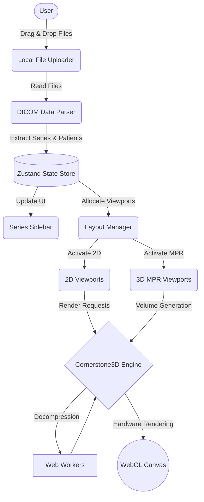

# Web DICOM Viewer

## Overview
A high-performance, fully client-side Medical DICOM Viewer built with React 19, Vite, and Cornerstone3D. The application is designed to process hundreds of medical images (CT/MRI) directly in the browser, ensuring strict patient data privacy by eliminating the need for server uploads. It features a modern dark glassmorphism interface, precise diagnostic tools, and advanced 3D Multi-Planar Reconstruction (MPR) capabilities.

## Key Features

### 1. Advanced Local File Management
- **Local Processing:** Complete parsing and rendering of DICOM files within the browser environment.
- **Bulk Upload Support:** Drag-and-drop support for entire directories containing single or multiple patient studies.
- **Smart Patient Management:** Automatic recognition and categorization of patient series, with safe deletion protocols and file clearance confirmations.

### 2. Modern UI & Localization (i18n)
- **Dark Glassmorphism Theme:** A sleek, dark interface optimized for medical environments to reduce eye strain, featuring smooth micro-animations.
- **Bilingual Support:** Full support for English and French with instantaneous switching without page reloads.
- **Interactive Sidebar:** Displays structured patient data, studies, and series alongside smart thumbnail previews.

### 3. Flexible Viewport Layouts
- Dynamic grid configurations: Single View (1x1), Dual View (1x2), Triple View (1+2), and Quad View (2x2).
- Independent viewports allowing simultaneous rendering of different series and seamless integration of 2D and 3D MPR modes.

### 4. Comprehensive 2D Diagnostic Tools
- **Navigation:** Precision Zoom, Pan, and dynamic Window/Level adjustments.
- **Measurements:** Length, Angle, Rectangle ROI, Elliptical ROI, and Freehand ROI tools.
- **Analytical Probe:** A custom-engineered Hounsfield Unit (HU) probe tool designed to bypass standard 2D voxel limitations for precise density readings.
- **Display Enhancements:** Cine (Auto-Play) playback with adjustable speeds, Color Inversion, and instantaneous Window presets (Soft Tissue, Lung, Bone, Brain).

### 5. Advanced 3D MPR (Multi-Planar Reconstruction)
- Reconstructs stacked 2D images into robust 3D volumes to display Axial, Sagittal, and Coronal planes simultaneously.
- **Synchronized Crosshairs:** Delivers exact 3D spatial localization across all intersecting planes.
- **Sync Tools:** Unified camera zoom and contrast level linking across all MPR viewports.

## System Architecture and Technologies

The system is built upon a strictly separated architecture to ensure uncompromised performance and stability:

- **Framework:** React 19 with Vite for rapid bundling and optimal performance.
- **Medical Rendering Engine:** Cornerstone3D utilizing WebGL for hardware-accelerated image processing.
- **State Management:** Zustand, providing a centralized data store to manage patient metadata and viewport states while preventing excessive React re-renders.
- **Data Processing:** `dicom-parser` and Web Workers for efficient metadata extraction and background pixel decoding.



## Installation and Setup

1. Install dependencies:
   ```bash
   npm install
   ```
2. Start the development server:
   ```bash
   npm run dev
   ```
3. Build for production:
   ```bash
   npm run build
   ```

---

*Note on Authorship and Collaboration:*
The codebase for this project was developed with the assistance of Artificial Intelligence. However, the overarching system architecture, component methodologies, and critical execution workflows were meticulously planned, directed, and authored by the human developer. Furthermore, direct human intervention and custom code authoring were required to resolve deep technical challenges—such as bypassing the 2D Probe Tool limitations and engineering polling systems to mitigate rendering engine race conditions—ensuring the application meets the highest standards of performance and reliability. The AI served as a highly capable pair-programmer, efficiently translating this complex engineering vision into reality.
